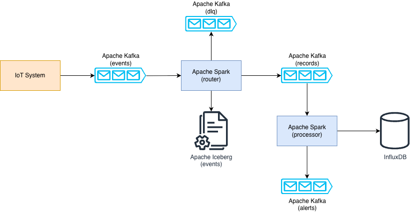

# Real-Time IoT Temperature Telemetry & Analytics Pipeline
An example of a production-grade, event-driven streaming data pipeline for processing temperature telemetry data, built with PySpark Structured Streaming, Apache Kafka, Apache Iceberg, and InfluxDB. The data flow ingests raw device telemetry, validates payloads against strict schema rules, routes invalid data to a Dead Letter Queue (DLQ), triggers real-time anomaly alerts, and sinks analytical data into both a time-series database and an open lakehouse table, providing analytics capabilities for both online and offline queries.

## Architecture Overview
To guarantee loose coupling, fault tolerance, and workload isolation, the pipeline splits the data flow into two specialized Spark streaming applications:

  
   
   
  High-Level Blueprint

### 1. Samples Router
- Consumes raw payloads from the initial Kafka input topic (iot.samples.raw).
- Parses JSON records and enforces schema structure constraints.
- **Data Cleansing & Validation**: Checks for corrupted JSON or physically impossible telemetry values (e.g., negative temperatures or power ratings).
- **Dynamic Routing**: Diverts corrupted or invalid messages to a Kafka Dead Letter Queue (DLQ) topic (iot.samples.dlq) for debugging, while valid data passes to a refined samples topic (iot.samples.refined).
- **Audit Trail**: Appends every incoming event's raw metadata footprint into a daily partitioned **Apache Iceberg lakehouse table** (iot_stream_analytics.events).

### 2. Samples Processor
- Consumes validated telemetry streams from the downstream Kafka refined samples topic.
- Computes metadata observability metrics like **network lag** and **ingestion pipeline latency** in real time.
- **SLA & Anomaly Monitoring**: Evaluates thresholds inline (temperature>85.0&deg;C or power>1500W). If violated, it surfaces immediate alert notifications back out to an asynchronous Kafka alerts queue (iot.alerts.anomaly).
- **Time-Series Sink**: Micro-batches are partitioned and distributed across workers to perform high-throughput chunked writes (500 points/batch max) into an **InfluxDB** bucket (iot-stream-analytics) for live monitoring dashboards.
